# Restaurante La Ratatouille

### Solución de: Germán Fernández Carracedo

### GitHub: germangfc

---

# Capturas ejecución

#### Inicio y evolución de la simulación
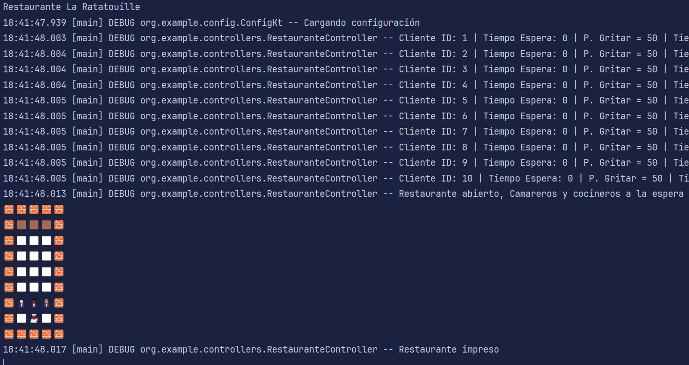
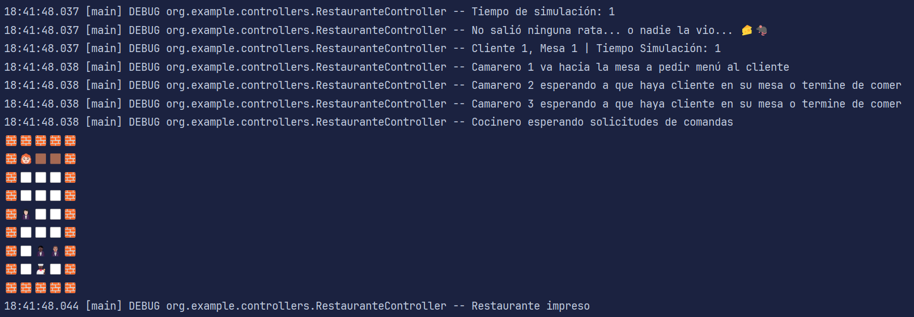
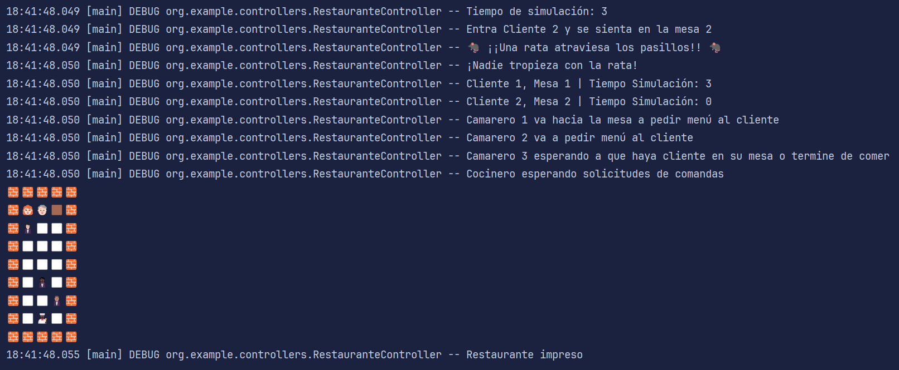
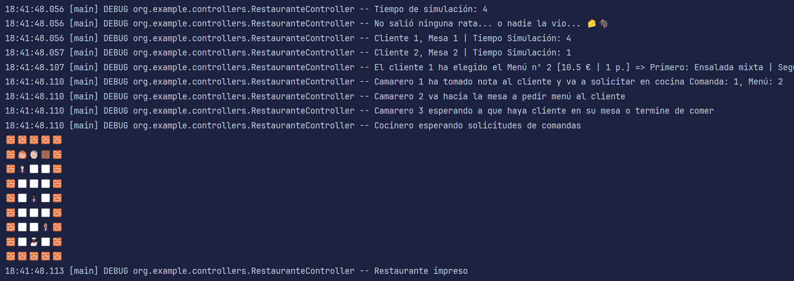
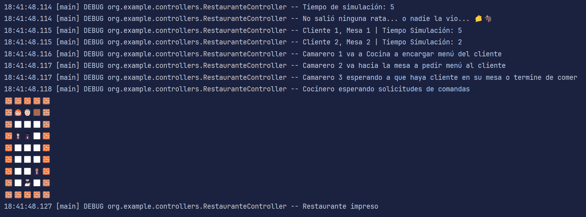
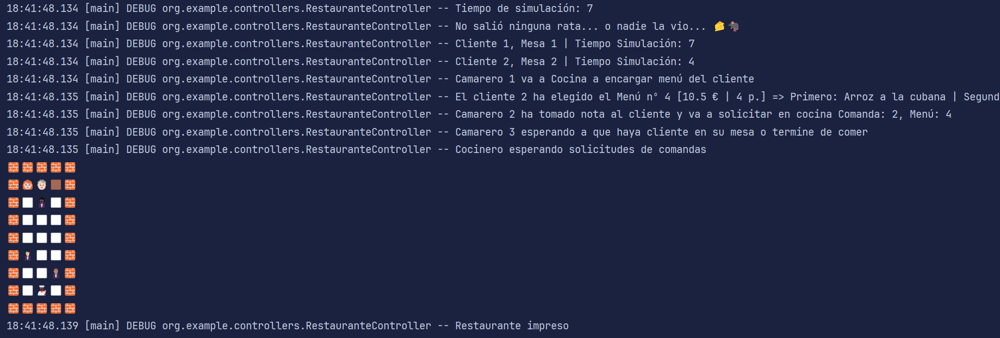
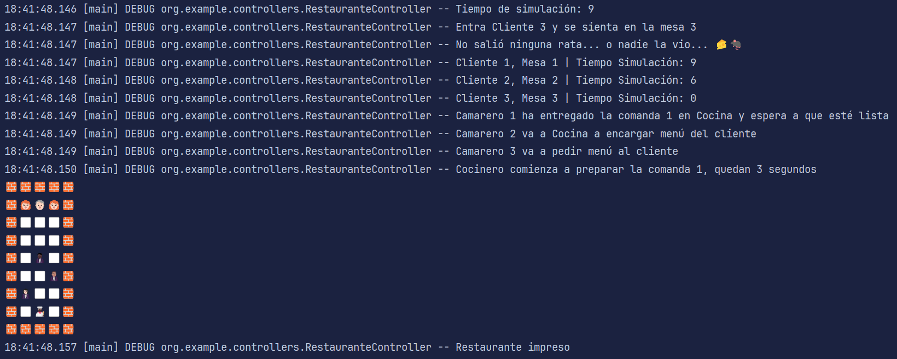
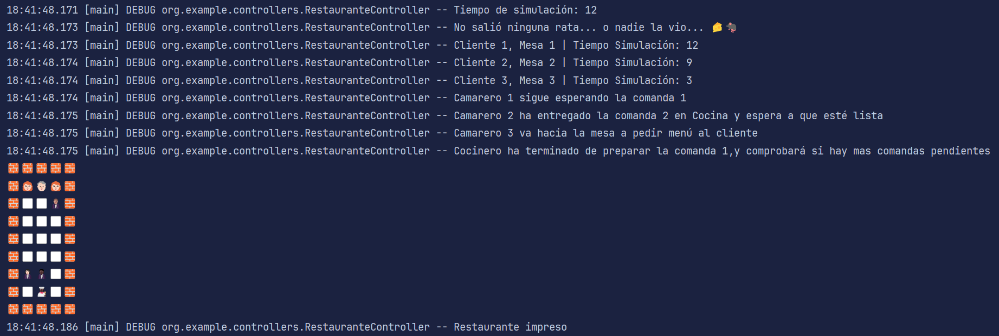

#### Cliente protesta porque no le atienden
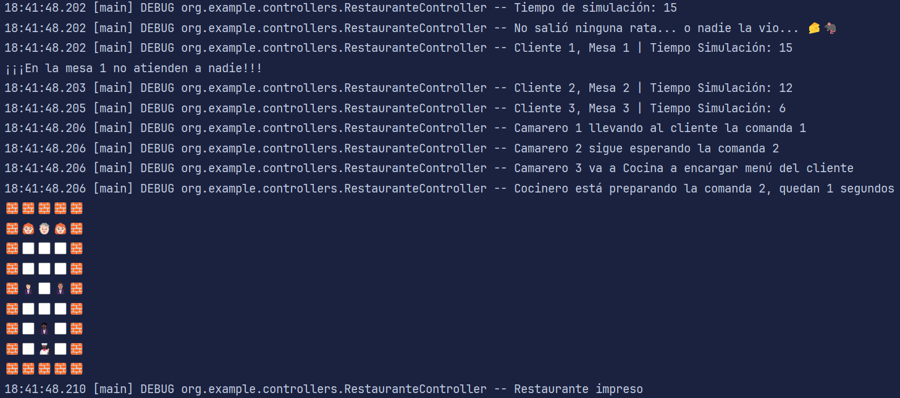

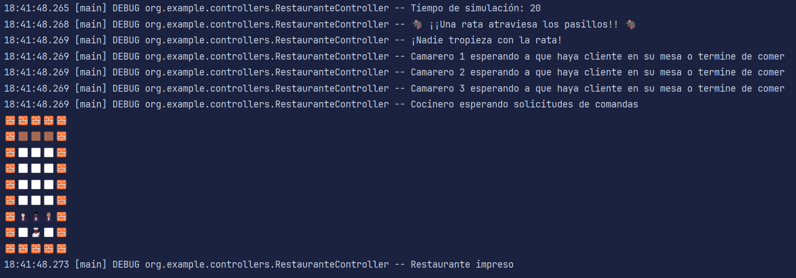
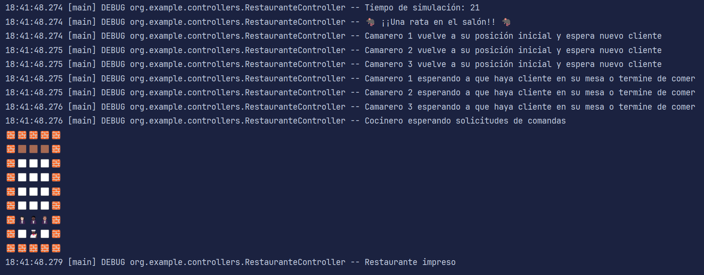
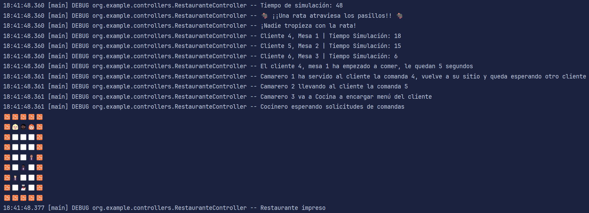
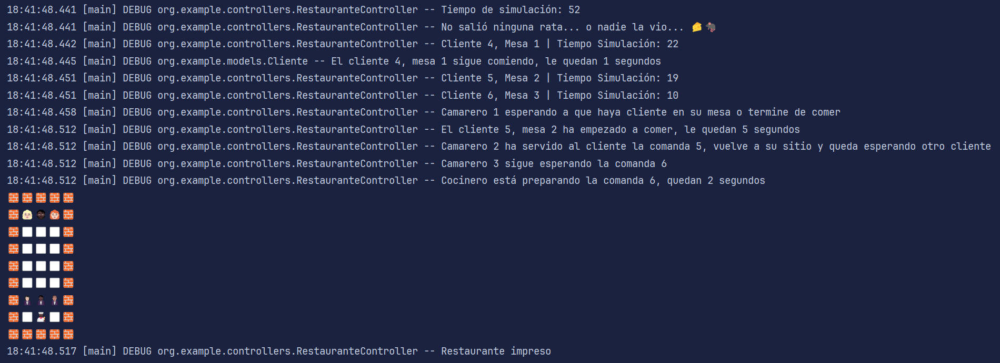
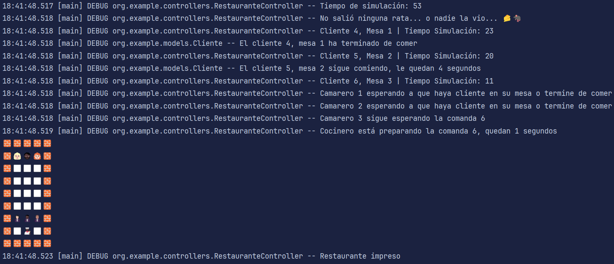
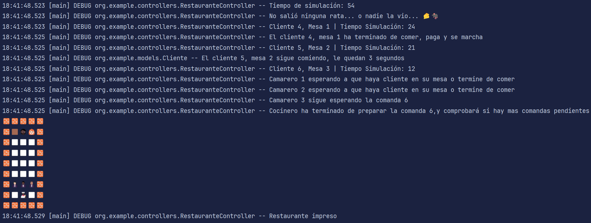
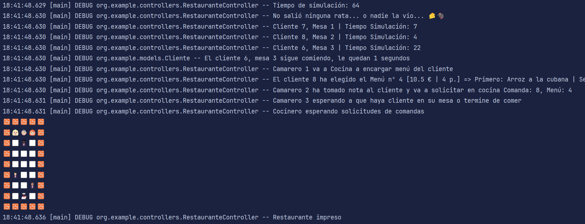
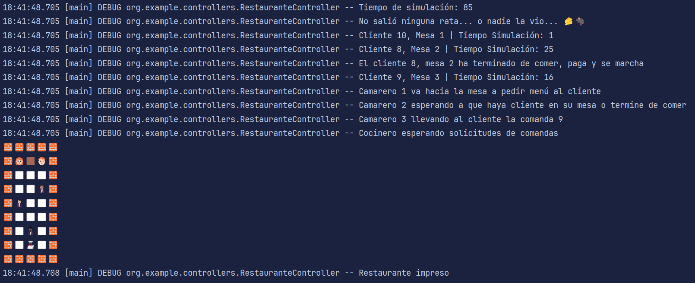
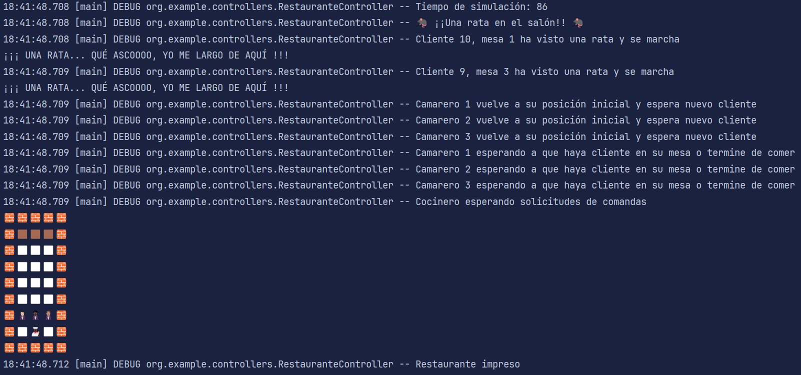
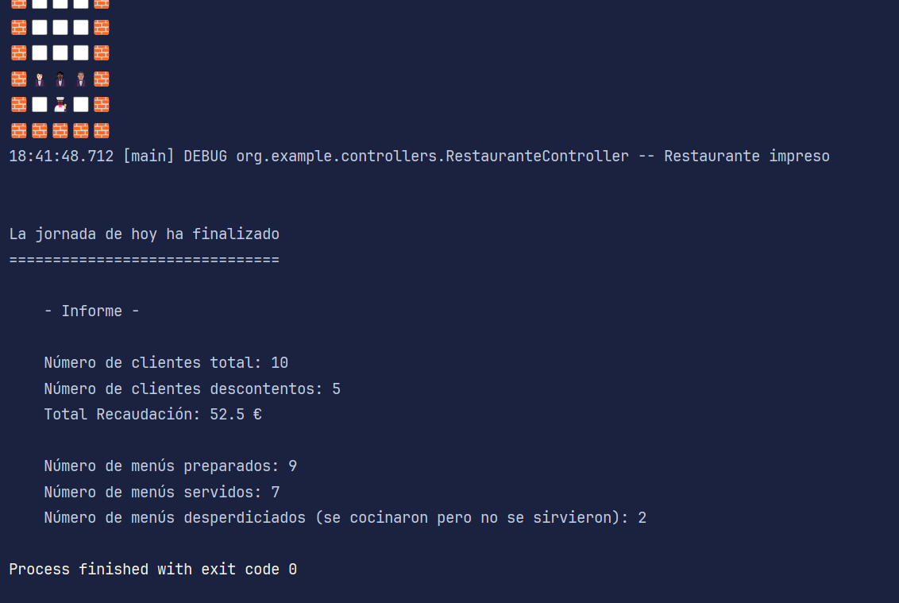

### Otros casos

#### Camarero cae al suelo mientras no llevaba bandeja
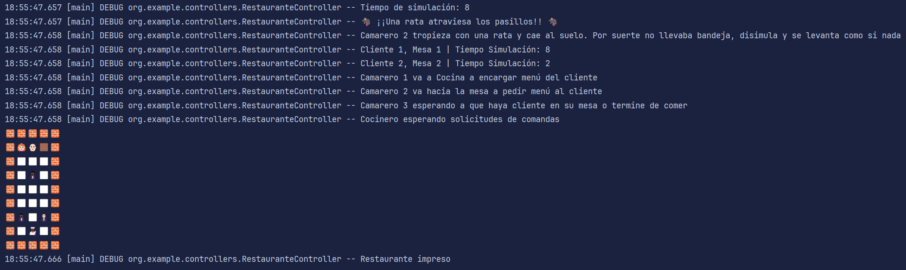

#### Camarero cae al suelo con bandeja, vuelve a la cocina

#### Cliente se marcha sin pagar porque no le atienden
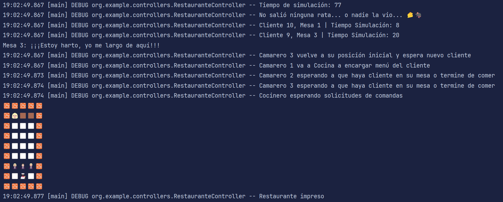
